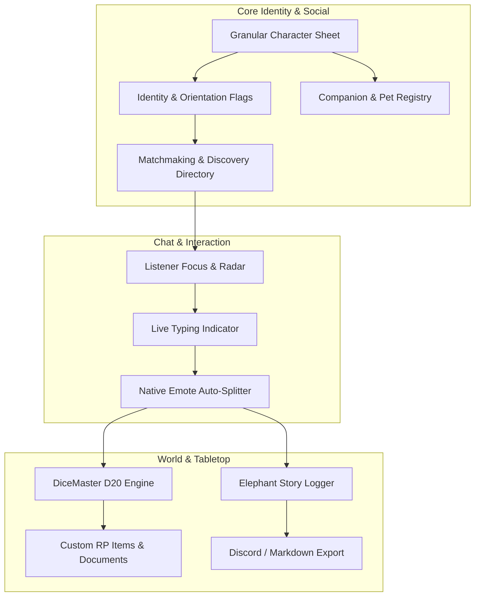
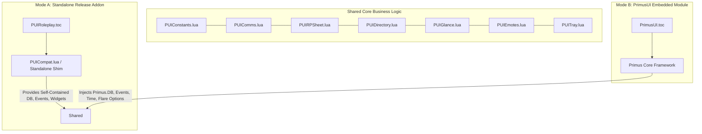
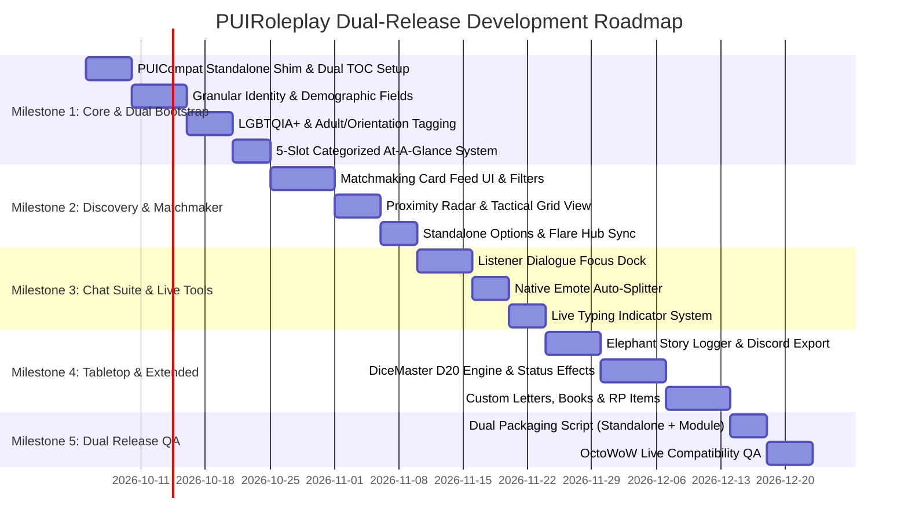

# PUIRoleplay (PUIRP) — Next-Generation Roleplay Architecture Specification
**Target Platform:** OctoWoW / TurtleWoW Ecosystem (World of Warcraft 1.12.1 / Lua 5.0.2)  
**Host Framework:** PrimusUI Social Framework  
**Document Revision:** 2.0.0-PROPOSAL  

---

## 1. Executive Summary & Vision

**PUIRoleplay (PUIRP)** is an all-in-one roleplaying suite engineered for the **OctoWoW** (1.12.1) client. It consolidates the distinct strengths of six major legacy and modern roleplaying addons into a single, cohesive, high-performance module:

1. **Total RP 3 & MyRolePlay (MRP)**: Deep demographic granularity, psychological sliders, 5 at-a-glance slots, and companion/pet profiles.
2. **Modern Social Discovery / Matchmaking**: Dating-app-inspired directory with multi-tag filtering (Orientation, LGBTQIA+, 18+/Adult, Romance Intent, Playstyle).
3. **Listener**: Mention alerts, smart chat focus, and proximity radar for busy taverns and events.
4. **Emote Splitter**: Native long-form text chunking across all chat channels without truncation.
5. **Elephant**: Persistent cross-session story archiving, scene bookmarking, and Markdown/Discord export.
6. **DiceMaster**: D20 combat engine, custom RP resources, status effects, and live typing indicators (`...`).
7. **TRP3 Extended**: In-game readable letters, books, custom inventory items, and coordinate-based stashes.



---

## 2. Character Profile & Demographic Architecture

The character sheet is upgraded to provide deep physical and narrative detail while maintaining zero clutter.

### 2.1 Identity & Nomenclature
* **Full Name Composition**: Dedicated fields for *Prefix / Title*, *First Name*, *Middle Name*, *Surname / Family Name*, *Nickname / Moniker*, and *House / Clan Affiliation*.
* **Display Format Customizer**: Allows selecting how names appear in tooltips, chat, and directory (e.g., `[Prefix] [First] [Last], [Title]` vs. `"[Nickname]" [First] [Last]`).

### 2.2 Physical Demographics & Origins
* **Age Structure**: Dual-tier age reporting:
  * *Apparent Age* (Visual presentation, e.g., "Late 20s").
  * *Actual Chronological Age* (True age, critical for Elves, Gnomes, Undead, and disguised beings).
* **Physical Metrics**: Eye Color, Height, Weight / Body Build, Complexion, and Notable Scars/Tattoos.
* **Geographical Lore**: Birthplace, Homeland / Nation, and Current Residence.
* **Current State & Mood**: Real-time emotional state (e.g., *Brooding*, *Exhausted*, *Euphoric*, *Alert*).

### 2.3 Psychological & Personality Sliders
Visual spectrum sliders allowing players to define core behavioral tendencies:
* `Chaotic` ◄──────────────────► `Lawful`
* `Cruel / Ruthless` ◄────────► `Merciful / Compassionate`
* `Pious / Devout` ◄──────────► `Pragmatic / Skeptical`
* `Cautious / Guarded` ◄──────► `Reckless / Impulsive`
* `Introverted / Stoic` ◄─────► `Extroverted / Flamboyant`

### 2.4 Extended At-A-Glance System (5 Slots)
Expanded from 3 to 5 slots, featuring categorized attribute badges:
* **Categories**: *Physical Trait*, *Distinctive Item*, *Visible Aura / Magic*, *Secret / Rumor*, *Combat Stance / Injury*.
* **Custom Attributes**: Per-glance icon selector, custom border tint, colored title, and markdown-friendly summary.

---

## 3. Adult, LGBTQIA+, & Orientation Flagging System

A structured, consent-forward tagging framework ensuring clear boundaries, player safety, and precise social discovery.

### 3.1 Content & Maturity Rating
1. **General (All Ages / PG-13)**: Standard fantasy adventure, casual banter, public tavern scenes.
2. **Mature Storytelling (18+ / Dark Lore)**: Heavy themes, graphic combat, dark magic, political horror, mature story arcs.
3. **Adult-Oriented / ERP (18+ Explicit)**: Explicit romance, erotic roleplay, private mature scenes.
* **Safety Protocols**: Global client-level toggle (*"Hide 18+ Content"*) with strict opt-in validation to ensure player protection.

### 3.2 LGBTQIA+ & Identity Tags
* **Community Flag**: Opt-in **LGBTQIA+ Friendly / Ally** badge displayed on profiles, glance pills, and tooltips.
* **Pronoun System**: Separate tracking for:
  * **IC Pronouns** (Character presentation, e.g., *She/Her*, *They/Them*, *He/Him*, *It/Its*).
  * **OOC Pronouns** (Player identity behind the screen).
* **Orientation / Sexuality Selector** (Optional / Opt-in):
  * *Heterosexual / Straight*
  * *Gay / Homosexual*
  * *Lesbian*
  * *Bisexual*
  * *Pansexual*
  * *Asexual / Demisexual*
  * *Queer / Questioning*
  * *Unspecified / Secret*

### 3.3 Relationship & Romance Intent
* **Relationship Status**: *Single*, *In a Relationship*, *Married*, *Betrothed*, *Widowed*, *Complicated*.
* **Romance Openness (IC)**:
  * *Actively Seeking Romance (IC)*
  * *Open to Natural Chemistry / Slow Burn*
  * *Platonic / Adventure Only*
  * *Closed / Taken*

---

## 4. Matchmaking & Social Discovery Engine (Directory 2.0)

Transforming the RP Directory into a modern discovery hub with dual browsing modes.

```
+---------------------------------------------------------------------------------------------------------+
| [🔍 Filter & Matchmaker Sidebar]   |  ROLEPLAY DIRECTORY: DISCOVERY FEED                                |
|-----------------------------------|---------------------------------------------------------------------|
| Presence:                         |  +---------------------------------------------------------------+  |
|  [x] In Character (IC)            |  | [Avatar] Lady Aurelia Sunstrider                              |  |
|  [ ] Looking for Contact (LFC)    |  | High Elf Mage-Scholar • Appears 25 (Real: 320) • She/Her      |  |
|  [ ] Storyteller / DM             |  | Tags: [🏳️‍🌈 LGBTQ+ Ally] [Pansexual] [18+ Mature] [Single]       |  |
|                                   |  | Romance: Open to Chemistry (IC) • Walkups: Highly Welcomed    |  |
| Identity & Orientation:           |  | Zone: Stormwind City (Mage Quarter) • Proximity: 15 yds       |  |
|  [x] LGBTQIA+ Friendly            |  | Hook: "Translating ancient Highborne astrological charts."    |  |
|  [x] Pan / Bi / Gay / Les         |  | [💬 Focus / Whisper]  [📖 View Profile]  [⭐ Bookmark]        |  |
|                                   |  +---------------------------------------------------------------+  |
| Maturity / Content:               |  +---------------------------------------------------------------+  |
|  [x] Adult / 18+ Allowed          |  | [Avatar] Grimnak Bloodfang                                    |  |
|  [ ] All Ages Only                |  | Orc Berserker • Appears 34 • He/Him                           |  |
|                                   |  | Tags: [Straight] [PG-13 Adventure] [Taken]                    |  |
| Romance Intent:                   |  | Romance: Platonic Only • Walkups: Ask OOC First               |  |
|  [x] Open to Romance (IC)         |  | Zone: Orgrimmar (Valley of Honor)                             |  |
|                                   |  | [💬 Focus / Whisper]  [📖 View Profile]  [⭐ Bookmark]        |  |
| Search Radius:                    |  +---------------------------------------------------------------+  |
|  [ Zone: Current (Elwynn) ▼ ]     |                                                                     |
+---------------------------------------------------------------------------------------------------------+
```

### 4.1 Browsing Modes
1. **Matchmaking Card Feed**: Large character cards showcasing avatar art, identity pills, compatibility flags, 1-line personality hooks, and quick-action buttons.
2. **Compact Tactical Grid**: Dense spreadsheet-style view sorted by Name, Zone, Distance, IC Status, or Last Spoke.

### 4.2 Compatibility Matrix & Filter Presets
* **Dynamic Match Badges**: Displays a subtle highlight if another player’s walkup openness, mature content settings, and romance intent align with your profile.
* **Quick Filter Tabs**:
  * *Near Me* (Proximity-based within current subzone).
  * *Dating & Romance* (Filtered for single/open characters matching orientation).
  * *Storytellers & DMs* (Filtered for campaign hosts and dungeon masters).
  * *Bookmarked / Favorites* (Quick access to regular roleplay partners).

---

## 5. Integrated Chat & Communication Suite

### 5.1 Listener Module (Proximity Radar & Dialogue Focus)
* **Smart Mention Engine**: Audio ping and visual screen pulse when your character’s first name, nickname, or full title is mentioned in `/say`, `/yell`, or `/emote`.
* **Dialogue Focus Dock**: A minimalist, semi-transparent HUD window that isolates chat between you, your target, and characters in your immediate 15-yard bubble.
* **Snooper Radar**: Sidebar list of nearby characters showing their IC status and a live counter indicating when they last spoke (e.g., *[Aurelia: 8s ago]*).

### 5.2 Native Emote Splitter
* **Zero-Truncation Posting**: Automatically monitors all outgoing chat messages. Messages exceeding the 255-character client limit are intelligently split at sentence and punctuation boundaries.
* **Sequenced Dispatch**: Posts are labeled with subtle pagination (e.g., `... [1/2]`) and dispatched via a burst-safe queue to prevent disconnections.

### 5.3 Live Typing Indicator (`...`)
* **Real-Time Composition Alert**: Transmits a lightweight channel signal when a player begins typing in an IC channel.
* **HUD & Nameplate Glow**: Displays an animated typing bubble above the player's head and on their Target Glance pill, eliminating accidental interruptions.

### 5.4 Custom Roleplay Tooltip Suite (TRP3-Style Mouseover)
Replaces the default Blizzard GameTooltip on player and companion mouseover with a rich, stylized, and fully configurable **Roleplay Tooltip**:

```
+-------------------------------------------------------------------------+
| [Avatar]  Lady Aurelia Sunstrider                                       |
|           Grand Magistrix of the Sunfury                                |
|           <House Sunstrider> [IC Guild]                                 |
|-------------------------------------------------------------------------|
| Status: [IC] In Character       |  RP Class: Highborne Arcane Scholar   |
| Race: High Elf                  |  Age: Appears 25 (Real: 320)          |
| IC Pronouns: She/Her            |  OOC Pronouns: She/They               |
|-------------------------------------------------------------------------|
| Tags: [🏳️‍🌈 LGBTQ+ Ally]  [Pansexual]  [18+ Mature]  [Single]            |
| RP Style: [Walkups Encouraged]  [Injury: By Consent]  [Romance: Open]   |
| Mood: "Studying ancient layline oscillations with intense focus."       |
|-------------------------------------------------------------------------|
| Glances: [🗡️ Runeblade]  [📜 Sealed Scroll]  [✨ Arcane Aura]  [👁️ Scar]   |
+-------------------------------------------------------------------------+
```

* **Custom Demographic Header**:
  * Character avatar icon embedded in the top-left corner.
  * Custom name and title text colored by class or custom roleplay palette.
  * IC vs. OOC Guild Affiliation tag (`<Guild Name> [IC]` or `<Guild Name> [OOC]`).
* **Identity & Status Badges**:
  * Real-time `[IC]`, `[OOC]`, `[LFC]` (Looking for Contact), or `[Storyteller / DM]` indicator.
  * Custom RP Class (e.g. *Blood Knight*, *Inquisitor*, *Apothecary*) overriding engine class.
  * Pronouns, Apparent Age, LGBTQIA+ Ally badge, and Orientation pills.
* **Current Mood & 5-Slot Glance Ribbon**:
  * 1-line real-time mood/action quote.
  * Visual row of 5 At-A-Glance icons rendered directly inside the tooltip frame.
* **Companion & Pet Tooltips**:
  * Mousing over hunter pets, warlock demons, mage elementals, or mounts displays their custom companion profile (Name, Breed, Master Name, and Physical traits).
* **Display & Anchoring Controls**:
  * Configurable tooltip anchoring (Cursor-anchored, Default GameTooltip anchor, or Fixed Smart Corner).
  * Toggle options for: Hide in Combat/Battlegrounds, Relative Level descriptor (*Formidable*, *Equal*), and Modifier Key preview (Hold `SHIFT` for full glance details).

---

## 6. Story Archiving, Tabletop & Item Systems

### 6.1 Elephant Story Logger (Persistent Roleplay Archives)
* **Session & Campaign Recording**: Automatically logs all `/say`, `/emote`, `/whisper`, and `/party` conversations into permanent SavedVariables.
* **Scene Tagging**: Built-in "Start Scene" / "End Scene" button to package specific events into named story logs.
* **Export Engine**: One-click **"Copy as Markdown / Discord Format"** to easily paste logs into character journals, wikis, or guild channels.

### 6.2 DiceMaster D20 Tabletop & Combat Engine
* **Custom RP Health & Resource Trackers**: Configurable health, stamina, and mana pools independent of in-game character stats.
* **Contextual D20 Roller**: One-click rolls with custom stat modifiers and narrative outcomes (e.g., `[D20 + 4 (Agility) = 19] Critical Success!`).
* **Custom Status Effects**: Apply and broadcast status icons (e.g., *Bleeding*, *Shielded*, *Poisoned*, *Unconscious*) visible on Target Glance pills.

### 6.3 TRP3 Extended Mechanics (Letters, Books & RP Inventory)
* **In-Game Letters & Books**: Create written documents with custom fonts, parchment backgrounds, and wax seals that can be handed to or traded with other players.
* **Custom RP Inventory**: Dedicated bag for unique roleplay items, trophies, and props.
* **Coordinate Stashes**: Plant inspectable clues or items at specific map coordinates for mystery events.

---

## 7. Network Architecture & OctoWoW Protocol

### 7.1 Protocol Structure
PUIRP implements a dual-layer communication system over the global `TTRP` channel:

```
[Standard TurtleRP Packet Layer]  --> Handles M, T, D packets & P/A pings (100% backward compatible)
[PUIRP Extended Metadata Layer]   --> Transmits X-packets for Orientation, Adult flags, Typing, & D20
```

1. **Standard Layer**: Ensures unmodified TurtleRP players can view name, title, description, and standard glances without errors.
2. **Extended Layer (`X:`)**: Broadcasts new identity tags, matchmaking metadata, typing states, and status effects to other PUIRP users.

### 7.2 Cross-Faction Discovery
Because the `TTRP` channel broadcasts globally across Alliance and Horde on OctoWoW, cross-faction profile inspection, directory searching, and map pins operate out-of-the-box with zero faction barriers.

---

## 8. Dual-Release Hybrid Architecture (Standalone vs. PrimusUI Embedded)

To ensure maximum distribution and flexibility, PUIRP is engineered using a **Universal Core Architecture**. It functions identically in two operating modes with 100% code sharing and zero runtime conflicts:



### 8.1 Adaptive Dependency Injection (`PUICompat.lua`)
A single micro-shim (`PUICompat.lua`) is loaded at startup to detect the host environment:

1. **When Running Embedded in `PrimusUI`**:
   * Registers as `Primus.PUIRoleplay` module inside the `Social` category.
   * Leverages `Primus.DB` (unified namespace management), `Primus.Events` (safe multi-handler dispatch), `Primus.Time` (centralized ticker pool), and `Primus.Widgets` (shared dark design system).
   * Injects settings directly into the **Primus Flare Options Hub** (`/pui options`).
   * Binds seamlessly with docked chat in **`PUITalk`**.

2. **When Running Standalone (`PUIRoleplay/` folder)**:
   * Initializes a lightweight, zero-dependency environment shim that provides:
     * **Independent Persistence**: Uses dedicated `SavedVariables: PUIRoleplayDB, PUIRoleplayCharDB`.
     * **Micro Event Bus & Ticker**: Native event routing and `OnUpdate` timing wrappers.
     * **Self-Contained Dark UI Widgets**: Built-in 1-pixel borders, editboxes, scroll frames, and buttons.
     * **Standalone Slash Router & Options Panel**: Independent `/rp` and `/ttrp` commands and a self-contained Interface Options window.

### 8.2 Conflict Prevention & Mutual Awareness
* If a user installs both `PrimusUI` and standalone `PUIRoleplay`, the module detects the duplicate initialization, logs a single non-blocking notice, and harmoniously yields to the PrimusUI-embedded instance to eliminate double-broadcasting and event collisions.

---

## 9. Dual-Release Development Roadmap (DevMap)



### Phase Breakdown & Validation Checkpoints

#### Milestone 1: Universal Bootstrap & Granular Demographics
* **Deliverables**:
  * Build `PUICompat.lua` abstraction shim for dual packaging.
  * Expand character profile schema to include split names, titles, dual-age tracking, physical stats, and psychological sliders.
  * Implement Adult/18+, LGBTQIA+, and orientation tagging with client privacy toggles.
  * Upgrade At-A-Glance system from 3 to 5 categorized slots.
* **Testing Gate**:
  * Verify 100% two-way wire compatibility with standard TurtleRP clients.
  * Verify clean loading in both standalone mode (without PrimusUI) and embedded mode.

#### Milestone 2: Discovery Engine & Directory 2.0
* **Deliverables**:
  * Build Dating/Matchmaking Card Feed with real-time tag filters.
  * Build compact tactical spreadsheet view with proximity sorting.
  * Integrate bookmarking and contact notes.
  * Implement dual settings interface (PrimusUI Flare Hub + Standalone Interface Options).
* **Testing Gate**:
  * Filter performance under 200+ cached character records with sub-millisecond search response.

#### Milestone 3: Real-Time Chat & Social Suite
* **Deliverables**:
  * Build **Listener** Dialogue Focus HUD and proximity mention alerts.
  * Implement zero-truncation **Emote Auto-Splitter** with sentence-aware chunking.
  * Implement channel-based **Live Typing Indicator** (`...`) with glance pill animations.
* **Testing Gate**:
  * Multi-client typing indicator test; flood-safe long-post transmission through `ChatThrottleLib`.

#### Milestone 4: Story Archiving, Tabletop & World RP
* **Deliverables**:
  * Build **Elephant** persistent chat logger with scene bookmarking and Markdown/Discord export.
  * Build **DiceMaster** D20 dice engine, RP health/resource bars, and custom status buffs.
  * Build **TRP3 Extended** custom letter/book editor, wax seal renderer, and RP inventory.
* **Testing Gate**:
  * Cross-session log recovery test after hard crash / `/console reloadui`.
  * Letter trading and reading between different clients.

#### Milestone 5: Packaging & Release Pipeline
* **Deliverables**:
  * **Target A**: Standalone ZIP distribution (`PUIRoleplay/` folder with embedded `PUICompat.lua` and its own `.toc`).
  * **Target B**: Embedded PrimusUI module distribution (`PrimusUI/Modules/Social/PUIRoleplay/`).
  * Release documentation, changelog, and slash command reference.

---
*End of Specification Document.*

