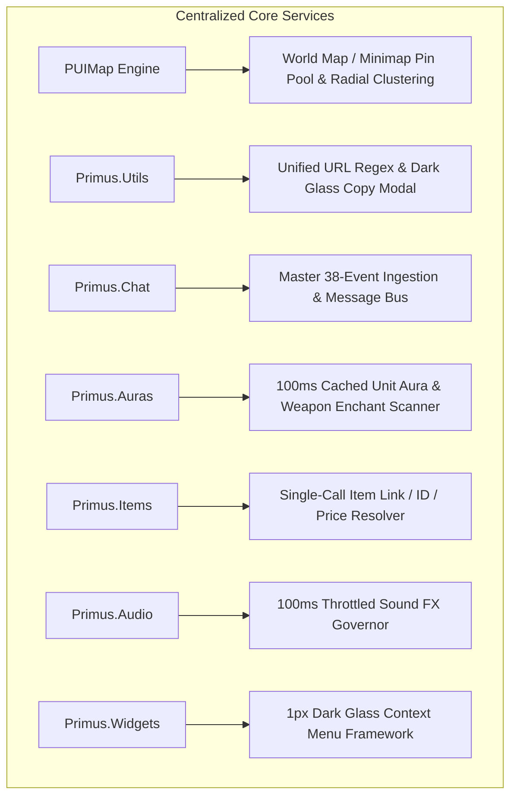

# PrimusUI: Master Architecture, System Specification & Development Roadmap (README.md)

> **Target Platform:** World of Warcraft 1.12.1 (Client Build 5875 | Interface `11200` | Lua 5.0.2)  
> **Repository Root:** `Interface/AddOns/PrimusUI`  
> **Status:** Active Production & Continuous Innovation  
> **Architecture Law:** Strict Canonical PUI Standard (Zero Aliases, Zero Shims, Single Domain Ownership)

---

## 📑 Master Table of Contents
1. [Executive Summary & Architectural Law (TRUTH)](#1-executive-summary--architectural-law-truth)
2. [Canonical Module Catalogue (All 35 Modules Across 5 Tiers)](#2-canonical-module-catalogue-all-35-modules-across-5-tiers)
3. [The 7 Centralized Core Services](#3-the-7-centralized-core-services)
4. [PUIRoleplay: 28-File Roleplaying & Tabletop Subsystem](#4-puiroleplay-28-file-roleplaying--tabletop-subsystem)
5. [Combat, HUD & Action Bar Innovations](#5-combat-hud--action-bar-innovations)
6. [World, Inventory & Database Engines](#6-world-inventory--database-engines)
7. [Completed Milestones & Verification Log](#7-completed-milestones--verification-log)
8. [Master Development Roadmap & Upcoming Sprints](#8-master-development-roadmap--upcoming-sprints)
9. [Console & Slash Command Reference Guide](#9-console--slash-command-reference-guide)

---

## 1. Executive Summary & Architectural Law (TRUTH)

PrimusUI is a complete, modular user interface replacement engineered specifically for the **Vanilla WoW 1.12.1** client. It replaces the fragmented, high-overhead addon ecosystem with a unified, high-performance architecture characterized by rich dark glassmorphism, 1-pixel borders, flat status textures, and zero garbage collection churn.

```
┌──────────────────────────────────────────────────────────────────────────────────────────────────┐
│                                    PRIMUS UI RUNTIME TIERS                                       │
├──────────────────────────────────────────────────────────────────────────────────────────────────┤
│ 🏛️ TIER 1: Core Foundation   : Bootstrap, DB, Events, Time, Memory, Options Flare Hub, Widgets  │
│ 🚀 TIER 2: Central Services  : PUIMap, Primus.Chat, Auras, Items, Audio, ContextMenu, Tooltips   │
│ ⚔️ TIER 3: Combat & HUD      : PUIHotbars, PUIHud (Wings/Timers/Bar 10 MiniBars), CastBar, Units │
│ 🎭 TIER 4: Social & Immersion: PUIRoleplay (28 Files), PUITalk, PUILogViewer, Listener, Elephant│
│ 📦 TIER 5: World & Utility   : PUIBags, PUIBank, PUIQuest (pfQuest DB), PUISellValue, PUIMover   │
└──────────────────────────────────────────────────────────────────────────────────────────────────┘
```

### Core Architecture Laws

#### 1. Lua 5.0.2 Compatibility & Engine Integrity
- **Language Level:** Strictly constrained to Lua 5.0.2 primitives. Modern Lua constructs (`#` length operator, `...` vararg expressions in functions, `string.gmatch`, `string.match`) are prohibited.
- **Table Lengths:** Always use `table.getn(tbl)` or explicit counter indexing.
- **Pattern Iteration:** Use `string.gfind(str, pattern)`.
- **String Extraction:** Use `string.find(str, pattern)` with capture unpacking.
- **Table Recycling:** Avoid temporary table creation in event/render loops. Use `Primus.Memory:AcquireTable()` and `ReleaseTable()`.
- **Unconstrained Combat Execution:** Leverages 1.12.1's unrestricted combat Lua execution (no protected frame state / `InCombatLockdown` restrictions) for instant click-casting, smart rescue assists, and dynamic action button reconfiguration.

#### 2. Canonical Nomenclature (Zero Aliasing / Zero Shims)
- **Unified Prefix:** Every source file, folder, local table, module registration, SavedVariables database key, Options Flare ID, and PUIMover target is canonically named `PUI<Name>` or `Primus.<Name>`.
- **Zero Aliasing:** Table aliasing (e.g. `local MyBars = PUIHotbars`) is banned.
- **Zero Metatable Shims:** Metatable proxy shims and global hijacking are prohibited across the entire codebase.

#### 3. Single Domain Ownership Model
- Every UI element, Blizzard FrameXML hook, and native C-API query is owned by exactly **one** designated module.
- Cross-module interaction occurs exclusively through public API requests or decoupled event signals (`Primus.Events:Fire` / `RegisterSignal`).

#### 4. Staged Lifecycle Engine & Options Flare Protocol
- **Boot Sequence:** 
  1. `PLAYER_LOGIN` $\rightarrow$ `OnInitialize()` (Database setup, SavedVariables migration, Options Flare registration).
  2. `PLAYER_ENTERING_WORLD` $\rightarrow$ `OnEnable()` (Frame construction, event listener binding, ticker activation).
- **Clean Teardown:** `OnDisable()` unregisters all event subscriptions via `Events:UnregisterAll(owner)`, cancels all timers via `Time:CancelAll(owner)`, and hides active frames cleanly without requiring a `/reload`.
- **Options Flare Protocol:** Modules announce lightweight descriptors (`Primus.Options:RegisterModuleOptions`) on boot with zero upfront frame allocations. The Master Options GUI dynamically builds and caches panels on demand.

---

## 2. Canonical Module Catalogue (All 35 Modules Across 5 Tiers)

```
PrimusUI/
├── Core/                              # Headless Foundation Services
│   ├── Auras/ (Auras.lua)             # 100ms Cached Unit Aura & Weapon Enchant Scanner
│   ├── Bootstrap/ (Bootstrap.lua)     # Boot Sequencer & Module Lifecycle Manager
│   ├── Chat/ (Chat.lua)               # Universal 38-Event Chat Message Bus
│   ├── Comm/ (Comm.lua)               # Inter-Addon Messaging Bus over SendAddonMessage
│   ├── Config/ (Options.lua)          # Master Command Center (25% Left / 75% Right GUI)
│   ├── Console/ (Console.lua)         # Centralized Slash Command Router (/pui, /primus)
│   ├── DB/ (DB.lua)                   # Multi-Profile Account/Char Database Manager
│   ├── Debug/ (Debug.lua)             # SafeCall Wrapper & In-Game Error Inspector
│   ├── Events/ (Events.lua)           # Central Master Event Listener & Signal Bus
│   ├── Keybind/ (Keybind.lua)         # Hover-to-Bind Keybinding Engine (/hoverbind)
│   ├── Media/ (Media.lua, Audio.lua)  # Texture/Font Registry & Sound Governor
│   ├── Memory/ (Memory.lua)           # Zero-Allocation Table Pooling & GC Throttling
│   ├── State/ (State.lua)             # Combat Focus Machine ("Zen" Blackout Fades)
│   ├── Time/ (Time.lua)               # Central Master OnUpdate Ticker Engine
│   ├── Utils/ (Utils.lua, Items.lua)  # String/Math Helpers & Single-Call Item Resolver
│   └── Widgets/ (Widgets.lua, ContextMenu.lua) # Dark Glass UI Factory & Popups
│
└── Modules/                           # Feature Modules
    ├── Bars/
    │   └── PUIHotbars/                # 120-Slot Virtual Action Bars & Multi-Faction XP Bar
    │       ├── PUIHotbars.lua         # Matrix Coordinator & 120-Slot Paging Tunnels
    │       ├── PUIButtons.lua         # 1px Button Skinning & Pure Dimension Scaling
    │       ├── PUIXPBar.lua           # Multi-Faction XP & Reputation Watchbar
    │       └── PUIMicroBags.lua       # Virtualized Micro Menu & Bag Tray
    ├── Combat/
    │   ├── PUICastBar/                # Player, Target & Mirror Cast Bars with Latency Tint
    │   ├── PUICombatAuras/            # Combat Log Aura Expiration Tracker
    │   ├── PUICombatLog/              # Precision 1.12 Combat Parser & Swing Rail Source
    │   ├── PUICombatText/             # Floating Scrolling Combat Text
    │   ├── PUIHunter/                 # Auto-Shot Bar & Ranged Auto-Repeat Engine
    │   ├── PUINameplates/             # Class-Colored Threat Nameplates with Cast Bars
    │   ├── PUIWarrior/                # Stance Dance Coordinator & Melee Swing Resets
    │   └── Range/                     # 40-Yard Range Dimming & Mana Usability Ticker
    ├── Content/
    │   ├── AutoMechanics/             # Auto-Dismount & Auto-Stand on Spell Cast
    │   └── FastLoot/                  # Instant Single-Frame Auto-Looting
    ├── Gathering/
    │   └── PUIGathering/              # Herbalism & Mining Node Tracking on Map
    ├── HUD/
    │   └── PUIHud/                    # Modular Central Combat Heads-Up Display
    │       ├── PUIHud.lua             # Master Coordinator & Situational Easing
    │       ├── PUIWings.lua           # Vertical Player & Target Vitals (HP/Power)
    │       ├── PUIMiniBars.lua        # Dedicated Bar 10 Cockpit Mini-Bars (Slots 109..116)
    │       ├── PUITimers.lua          # Dual-Swing, GCD & Enemy Interrupt Rails
    │       ├── PUITriage.lua          # Central Emergency MT Health Array
    │       └── PUIActiveAssist.lua    # Left Peel & Protect / Right Focus Fire Buttons
    ├── Player/
    │   ├── PUIAuras/                  # Player Buff/Debuff Icons with Exact Timers
    │   ├── PUIBags/                   # Unified All-In-One Container with Item Sorting
    │   ├── PUIBank/                   # Unified Bank Container with Offline Inventory Caching
    │   ├── PUICharacterSheet/         # Detailed Extended Character Stats & Gear Durability
    │   ├── PUIItemCompare/            # Dual Shift-Hover Gear Comparison Tooltips
    │   ├── PUIItemStats/              # Stat Delta Calculations on Gear Tooltips
    │   ├── PUIProfession/             # Crafting Assistant & Reagent Overview
    │   ├── PUIQuest/                  # Integrated Quest DB (pfQuest), POI Pins, 3D Arrow
    │   ├── PUIQuestWatch/             # Persistent Quest Tracker (Fixes 5-min timeout bug)
    │   ├── PUISellValue/              # Hybrid Offline Vendor Price DB + Realm Auto-Learning
    │   └── PUISpellbook/              # Multi-Rank Flyouts & Spell Training Costs
    ├── Social/
    │   ├── MasterLoot/                # Raid Roll Tracker & Loot Distribution Helper
    │   ├── PUILogViewer/              # Standalone 5-Tab Chat/RP Log Viewer & URL Extractor
    │   ├── PUIRoleplay/               # Complete 28-File Roleplaying & Tabletop Subsystem
    │   └── PUITalk/                   # Tabbed Chat Engine, Inline URL Links, EditBox Styling
    ├── UnitFrames/
    │   └── PUIUnitFrames/             # Player, Target, ToT, Pet, Party & 40-man Raid Frames
    └── Utility/
        ├── AuctionHouse/              # Undercut Calculator & Batch Buying Assistant
        ├── Inspect/                   # Throttled Inspect Queue with Target Talent Caching
        ├── Mailbox/                   # "Take All" Mass Mail Collection & Cash Summaries
        ├── PUIDock/                   # Sliding Sidebar Utility Panels
        ├── PUIMap/                    # Central World Map & Minimap Pin Management Engine
        ├── PUIMerchant/               # 15s Patient AH Scanner, Quantile Market Indexer, Native Bar Graphs, Dockable Flyout & Offline Explorer
        ├── PUIMover/                  # Categorized Floating Control Dock & Magnetic Grid
        └── PUITooltip/                # Universal Tooltip Subsystem & Single-Owner Pipeline
```

---

## 3. The 7 Centralized Core Services

To eliminate cross-module code duplication, frame fighting, and GC stutter, PrimusUI centralizes seven core operational domains into dedicated single-owner engines:



1. **🗺️ World Map & Minimap Pin Management ([`PUIMap.lua`](file:///home/primustech/Downloads/OctoWoW/Interface/AddOns/PrimusUI/Modules/Utility/PUIMap/PUIMap.lua)):**
   - Single owner of `WORLD_MAP_UPDATE` with reusable pin frame and GPS route dot pools.
   - Automatic radial cluster fanning and spiral coordinate offsets for co-located objectives, gathering nodes, and players.
   - Consumers: `PUIQuest` (Map), `PUIRoleplay` (`PUIMapPins.lua`), `PUIGathering`.

2. **🌐 Web URL Parsing & Interactive Copy Modal ([`Core/Utils/Utils.lua`](file:///home/primustech/Downloads/OctoWoW/Interface/AddOns/PrimusUI/Core/Utils/Utils.lua)):**
   - Standardized protocol and domain regex matching (`http://`, `https://`, `www.`, `discord.gg`, `carrd.co`, `toyhou.se`, `youtube.com`, `spotify.com`, `twitch.tv`).
   - Interactive 1-pixel dark glass copy popup (`Primus.Utils.ShowURLDialog`) with auto-highlighted text.
   - Consumers: `PUITalkCopy`, `PUILogViewer`, `PUIRoleplay`.

3. **💬 Universal Chat Ingestion & Stream Pipeline ([`Core/Chat/Chat.lua`](file:///home/primustech/Downloads/OctoWoW/Interface/AddOns/PrimusUI/Core/Chat/Chat.lua)):**
   - Single master listener frame for all 38 `CHAT_MSG_*` events.
   - Zero-allocation message object pooling (`recycledMsgObj`) with ordered priority dispatch.
   - Consumers: `PUITalk`, `PUILogViewer`, `PUIRoleplay`, `PUIListener`, `PUIElephant`.

4. **🩸 Unit Aura & Weapon Enchant Scanner ([`Core/Auras/Auras.lua`](file:///home/primustech/Downloads/OctoWoW/Interface/AddOns/PrimusUI/Core/Auras/Auras.lua)):**
   - 100ms cached unit buff/debuff queries (`GetUnitAuras`), temporary weapon enchant queries (`GetWeaponEnchants`), group cleansables (`GetGroupCleansableDebuffs`), and dispel colors.
   - Consumers: `PUIAuras`, `PUIWings`, `PUIUnitBase`, `Utils.CleanseNextMember`.

5. **📦 Centralized Item Link / ID / Stat Resolver ([`Core/Utils/Items.lua`](file:///home/primustech/Downloads/OctoWoW/Interface/AddOns/PrimusUI/Core/Utils/Items.lua)):**
   - Single-call structured query pipeline (`Items:Get(linkOrID)`), standard hex quality colors, currency formatters, and static/live vendor price lookups.
   - Consumers: `PUIBags`, `PUIMerchant`, `PUIBank`, `PUIItemCompare`.

6. **🔊 Sound Playback Governor ([`Core/Media/Audio.lua`](file:///home/primustech/Downloads/OctoWoW/Interface/AddOns/PrimusUI/Core/Media/Audio.lua)):**
   - 100ms throttle per sound token to prevent audio stacking/clipping during batch events.
   - Global sound mute and volume governance.
   - Consumers: `PUISpellbook` (Page turns), `PUIListener` (Mentions/Chimes).

7. **📑 Context Menu Framework ([`Core/Widgets/ContextMenu.lua`](file:///home/primustech/Downloads/OctoWoW/Interface/AddOns/PrimusUI/Core/Widgets/ContextMenu.lua)):**
   - 1-pixel dark glass popup menu with headers, icons, checkmarks, separators, subtitles, and outside-click auto-dismissal. Eliminates Blizzard `UIDropDownMenu` taint.
   - Consumers: `PUIXPBar` (Factions), `PUISpellbook` (Spell ranks), `PUIDirectory` (Right-click player actions).

---

## 4. PUIRoleplay: 28-File Roleplaying & Tabletop Subsystem

**PUIRoleplay (PUIRP)** consolidates Total RP 3, MyRolePlay, Listener, Elephant, DiceMaster, and TRP3 Extended into a cohesive, high-performance 28-file modular architecture:

```
PUIRoleplay/
├── PUIConstants.lua         # Data model, defaults, 4 profile slots (0..3), nomenclature composition
├── PUIIcons.lua             # Categorized index of 2,000+ icons
├── PUIProtocols.lua         # Wire serialization, RP Text Codec (@N), DrunkCodec, SplitString
├── PUIComms.lua             # Multi-channel dispatcher, 30s background telemetry pings
├── PUIIconPicker.lua        # Visual searchable icon browser modal
├── PUICardPreview.lua       # Live character card preview modal
├── PUIRPWidgets.lua         # Glassmorphic sliders, checkboxes, and badge chips
├── PUIRPTabIdentity.lua     # Identity & Demographics tab (Names, Titles, House, Pronouns)
├── PUIRPTabAppearance.lua   # Appearance tab (Dual ages, Height, Weight, Build, Complexion, Bio)
├── PUIRPTabPersonality.lua  # Personality tab (5 behavioral spectrum sliders)
├── PUIRPTabLore.lua         # Lore tab (Origins, Motto, Faction, 6 History Chapters)
├── PUIRPTabRules.lua        # Rules tab (RP style, Injury/Death consent, ERP boundaries, 18+)
├── PUIRPTabMatchmaking.lua  # Matchmaking tab (Social discovery tags, Romance intent, Walkups)
├── PUIRPTabSettings.lua     # Settings tab (Profile switcher, Private GM notes, Export/Import)
├── PUIRPSheet.lua           # Master 7-Tab Character Sheet orchestrator
├── PUIGlance.lua            # Target At-A-Glance HUD pill (5 slots) with PUIMover registration
├── PUITooltip.lua           # Unit tooltip RP metadata injection via PUITooltip provider
├── PUIDirFlyout.lua         # 5-Tab Player Dossier Flyout Window for inspecting remote profiles
├── PUIMapPins.lua           # World Map RP Player Location Pins
├── PUIDirectory.lua         # Searchable Directory & Discovery Matrix (Card Feed & Tactical Grid)
├── PUIEmotes.lua            # Long-Form Emote Auto-Splitter (sentence-aware chunking)
├── PUIListener.lua          # Proximity Mention Radar & Focus Tracker with audio pings
├── PUIElephant.lua          # Story & Scene Archiver with Markdown / Discord export
├── PUIDice.lua              # DiceMaster D20 Tabletop & Combat Engine (Stats, Bars, Rolls)
├── PUIExtended.lua          # RP Inventory Pouch & Letter Forge (Parchment & Wax Seals)
├── PUIImporter.lua          # Multi-Addon Importer (TRP2, TRP3, MRP, FlagRSP)
├── PUITray.lua              # RP Quick Action Tray (IC/OOC toggle, Sheet, Directory, Dice, Walk)
└── PUIRoleplay.lua          # Master Coordinator, Flare handshake, slash command router
```

### Core Innovations in PUIRoleplay

1. **Universal Nomenclature Composition:**
   - Deconstructs character names into *Prefix*, *First Name*, *Middle Name*, *Last Name*, *Nickname*, *Title*, *Epithet* (*Suffix*), and *House/Clan/Tribe*.
   - Dynamically composes names via `ComposeFullName` and `ComposeTitle`, intelligently applying prepositions (e.g. `Lord Arthur of House Pendelton, the Valiant`).

2. **RP Text Codec Pipeline (`PUIRoleplay:UnescapeRPText` / `EscapeRPText`):**
   - Converts wire escape sequences:
     - `@N` / `@n` $\rightarrow$ `\n` (newline)
     - `@J` / `@j` $\rightarrow$ `\n` (soft return / paragraph)
     - `@T` / `@t` $\rightarrow$ `    ` (4-space tab indent)
     - `@@` $\rightarrow$ `@` (literal at-sign)
   - Performs automatic decoding on inbound packets, legacy imports, and UI rendering layers.
   - Performs automatic encoding before outbound transmission over `#OWPRP` and `#TTRP` channels.
   - Dynamic height calculation (`GetStringHeight()`) in long-form scroll frames ensuring arbitrarily long backstories can be fully viewed without truncation.

3. **Multi-Channel Discovery & Online Status:**
   - 100% two-way wire-protocol compatibility with TurtleRP and MRP over `#OWPRP` and `#TTRP`.
   - Real-time online presence tracking (`IsPlayerOnline`) backed by a 180-second heartbeat window.
   - DrunkCodec multi-byte ANSI/UTF-8 decoding restoring missing "S" characters in zone names.

---

## 5. Combat, HUD & Action Bar Innovations

### 1. PUIHud: Precision Vertical HUD & Dual-Swing Timing Suite
Anchored to the center of the screen with customizable center negative space:
- **Vertical Status Wings:** Left Wing (Player HP & Power) and Right Wing (Target HP & Power) with 1-pixel borders and situational opacity easing (20% Idle $\rightarrow$ 80% Target $\rightarrow$ 100% Combat).
- **HUD Mini-Bars (Bar 10 Slots 109..116):** Backed by Blizzard's native Bar 10 backend slots. 4 buttons on Left Wing (`109..112`) and 4 buttons on Right Wing (`113..116`) supporting native drag-and-drop from Spellbook/Bags, range tinting, and mana usability without stance collisions.
- **Dual ActiveAssist Smart Action Buttons:**
  - *Left ActiveAssist (Peel & Protect / 2-Click "Claim & Execute"):*
    - **Stage 1 (🔴 Red):** Threat alert detected on non-tank. Click 1 claims the rescue and broadcasts a lockout across `Primus.Comm` (`CLAIM:<PlayerName>:<ThreatTarget>`).
    - **Stage 2 (🟡 Amber):** Armed 1.5s timeout window. Click 2 snaps target to attacker and casts class rescue spell (Taunt, BoP, Nova, Kick).
    - **Stage 3 (🟢 Green):** Successful execution holding emerald green for 1.0s before fading out.
  - *Right ActiveAssist (Focus Fire):* Monitors Main Tank's active combat target for 1-click raid target snapping.
- **Combat Timing Rails:** Player swing timer (MH/OH/Ranged with Hunter auto-shot cadence), enemy white-hit attack cadence tracker, symmetric GCD rail, and enemy interrupt lockout timers.

### 2. PUIHotbars: Virtualized Action Bars & Matrix Layout
- **120-Slot ID Reuse Pool:** Abstract slot allocator managing Blizzard action slots (`1..120`) across stance and modifier paging tunnels without frame stacking.
- **Dynamic Matrix Sliders:** Independent **Rows (1–12)** and **Columns (1–12)** sliders per bar in `/pui config` supporting `12x1`, `1x12`, `6x2`, `3x4`, and custom grids.
- **Multi-Faction XP & Reputation Watchbar (`PUIXPBar.lua`):** Silent non-destructive scanning of character sheet reputations discovering 100% of player factions with stacked/cycle/split display modes.

### 3. Click-Casting & Group Cleansing
- Unconstrained 1.12.1 click-to-heal execution (`CastOnUnit`) with target preservation (`TargetLastTarget`).
- Emergency 1-click group cleanse scanner (`CleanseNextMember`) and debuff border highlights.

---

## 6. World, Inventory & Database Engines

### 1. PUIQuest: Integrated Quest Database & Navigation
- **Zero-Shim Database (`PUIQuest.DB`):** Absorbed complete Vanilla 1.12.1 and Turtle WoW quest/item/unit database directly into PrimusUI without legacy `pfDB` globals.
- **Delta-Patching Engine (`Patchtable.lua`):** 1-click toggling between pure Vanilla and Turtle WoW / Custom content with custom race bitmask support (Goblin [256], BloodElf [512]).
- **108-Frame 3D HUD Navigation Arrow (`Tracker.lua`):** Precision $9 \times 12$ UV cell coordinate resolver ($3.33^\circ$ per frame) with Minimap Child #9 model facing engine and movement delta fallback.
- **POI Pin Overlays & Minimap Radar:** Radial cluster fanning on World Map and minimap perimeter clamping with yard distance estimation.
- **In-Game Database Browser (`/pui db`):** Dark glass search browser for all in-game entities.

### 2. PUISellValue: Hybrid Item Pricing Engine
- **Tier 1 (Built-In Static DB):** Fast numeric key-value store (`itemID -> price`) for 25,000+ Vanilla and Turtle WoW items.
- **Tier 2 (Realm Auto-Learning Cache):** Autonomous merchant interception learning prices dynamically into `PrimusGlobalDB`.
- Universal tooltip injection formatting single item and stack prices without duplicate rows when vendor windows are open.

### 3. PUIBags & PUIBank: Unified Container Suite
- Unified All-In-One inventory window for Bags 0–4 and Bank with live item search and quality-colored borders.
- Automated inventory sorting (`[SORT]`) with rule-based priority categorization and cursor swap queue.
- Persistent offline Bank inventory caching (`PrimusCharDB.PUIBankCache`).

### 4. PUIMerchant: Advanced Economy & Valuation Engine (Auctioneer + TSM Fusion)
- **15-Second Patient AH Scanner:** Strictly respects private server DDoS rate limiters (15.0s inter-page cooldown) with live 1-second countdown display (`Next query in 14s...`), watchdog timeout recovery, and category scope selectors.
- **Statistical Quantile Engine:** Calculates daily Mean, Total Volume ($N$), 50th percentile Median, Core Fair Market Cluster ($\pm 15\%$), Low Tier (cheapest 35% sniping floor), High Tier (top 35% ceiling), and volume-weighted 7-Day / 14-Day Running Averages with automated 14-day history pruning.
- **Auction House Dark Glass Skin & Flyout Drawer:** Replaces default parchment UI with 1-pixel dark glass borders, flat tabs with active cyan underlines, and a dockable control drawer switchable to either the Left or Right side.
- **Native FrameXML Market Cluster Bar Graphs:** 3-tier box-plot bars (Green = Low 35%, Gold/Cyan = Core Median, Red = High 35%) with Running Average horizontal reference lines and interactive column hover breakdowns.
- **Offline Market Explorer & TSM Deal Finder (`/pui market`):** Standalone modal to browse cached AH prices anywhere in the world, filter by quality/category, and identify deals ($\le 70\%$ MV) or guaranteed vendor arbitrage opportunities.
- **1-Click Seller Assistance:** Automatically calculates optimal undercut prices from 7-day medians and prefills buyout and bid inputs when dropping items into the Auctions tab.

---

## 7. Completed Milestones & Verification Log

- [x] **Core Foundation & Lifecycle Runtime:** 100% canonical nomenclature, 2-phase boot sequencer, memory table pooling, ticker engine, multi-profile database, and PUIMover categorized dock.
- [x] **Master Options GUI Redesign:** 25% Left Command Center / 75% Right dynamic LoD canvas with frame caching.
- [x] **The 7 Centralized Core Services:** `PUIMap`, `Primus.Utils` URL extraction, `Primus.Chat` message bus, `Primus.Auras` 100ms cache scanner, `Primus.Items` resolver, `Primus.Audio` sound governor, `Primus.Widgets:ShowContextMenu` context menus.
- [x] **Combat & HUD Systems:** Precision combat log, dual swing timers, PUIHotbars matrix virtualization, PUIHud modular deconstruction, Bar 10 mini-bars, click-casting, range dimming, and cast bars.
- [x] **PUIRoleplay 28-File Suite:** 7-tab character sheet, discovery directory, dossier flyout, glance pill, world map pins, D20 tabletop engine, RP letters/stashes, Elephant logger, Listener radar, emote splitter, RP tray, and multi-addon importer.
- [x] **RP Text Codec & Wire Hardening:** `@N`/`@J`/`@T`/`@@` newline translation pipeline, dynamic lore scroll sizing, online presence ping routing fix (180s heartbeat), and `ComposeFullName` fallback resolution.
- [x] **World, Inventory & Database:** PUIQuest integrated database with 3D HUD arrow, PUISellValue hybrid pricing, PUITooltip single-owner pipeline, PUIBags/PUIBank with offline caching.
- [x] **Lua 5.0.2 Verification:** 100% pass on repository-wide Lua 5.0.2 static AST validation across all files.

---

## 8. Master Development Roadmap & Upcoming Sprints

```mermaid
graph TD
    subgraph SPRINT 2: Tactical Combat & Assist Innovation
        A[ActiveAssist 2-Click Protocol] --> B[Comm Lockout Broadcast]
        B --> C[Triage MT Health Forecast]
        C --> D[PUIUnitFrames Raid Grid Layouts]
    end

    subgraph SPRINT 3: Economy & World Systems
        E[Auction House Enhancer] --> F[TradeSkill Reagent Estimator]
        F --> G[Tavern Mini-Games]
    end

    subgraph SPRINT 4: Performance Profiling & Release
        H[Long-Session GC Benchmarks] --> I[Comprehensive User Manual]
    end

    SPRINT 2 --> SPRINT 3
    SPRINT 3 --> SPRINT 4
```

### ⚔️ Sprint 2: Tactical Combat & Group Assist Innovation
1. **ActiveAssist Inter-Client Lockout Protocol (`Primus.Comm`):** Fine-tune `CLAIM:<PlayerName>:<ThreatTarget>` broadcast over addon comms to synchronize aggro claims across multiple raid members using PrimusUI.
2. **PUIHud Triage Array Reassurance Flash:** Polish emergency visual feedback when MT health rebounds from critical levels.
3. **PUIUnitFrames Raid Density Presets:** Add 40-man, 20-man, 10-man, 5-man, and Auto-Adaptive quick-switch grid density presets in `/pui config`.

### 💰 Sprint 3: Economy, Professions & Social Polish
1. **PUIAuctionHouse Integration:** Connect auction search and posting directly with `Primus.Items` and `PUISellValue` for automatic undercut calculations.
2. **Crafting & TradeSkill Assistant (`PUIProfession`):** Provide reagent inventory availability badges and total recipe material cost summaries.
3. **Tabletop & Tavern Expansion:** Add interactive tavern games (e.g. Tavern Chess / Dice duels) inside `PUIDice.lua`.

### 🧪 Sprint 4: Performance Profiling & Documentation
1. **Endurance GC Profiling:** Run memory benchmarks across 2+ hour 40-man raid sessions to ensure zero heap leaks.
2. **Interactive User Guide:** Create a user-facing visual documentation guide with screenshots and command references.

---

## 9. Console & Slash Command Reference Guide

| Command | Subcommands / Arguments | Description |
| :--- | :--- | :--- |
| **`/pui`** or **`/primus`** | *(no args)* | Opens the Master Command Center Options GUI |
| **`/pui move`** | `[bars \| units \| hud \| class \| all]` | Toggles PUIMover mode for the specified category or all frames |
| **`/pui bind`** or **`/hoverbind`** | *(no args)* | Toggles the Hover-to-Bind keybinding interface |
| **`/pui cleanse`** | *(no args)* | 1-Click emergency smart cleanse on the most critical group member |
| **`/pui db`** or **`/pui quest show`**| `[query]` | Opens the in-game Quest, Item, NPC, and Object database browser |
| **`/pui quest turtle`** | *(no args)* | Toggles Turtle WoW custom database delta-patching on/off |
| **`/puiurl`** | `[url]` | Opens the standardized 1-pixel dark glass URL Copy Dialog |
| **`/pui memory`** | *(no args)* | Prints table pool diagnostics and executes a garbage collection cycle |
| **`/pui errors`** | *(no args)* | Opens the Primus Error Trap session error log |
| **`/rp`** or **`/ttrp`** or **`/pui rp`** | *(no args)* | Opens the 7-Tab Master Character Sheet |
| **`/rp dir`** | `[query]` | Opens the Roleplay Matchmaking Directory & Discovery Matrix |
| **`/rp dice`** | `[expression]` | Opens the DiceMaster D20 Tabletop & Combat Engine |
| **`/rp tray`** | *(no args)* | Toggles the RP Quick Action & Immersion HUD Tray |
| **`/rp chat`** | `[text]` | Opens the Long-Form Emote Auto-Splitter composer |
| **`/rp log`** | *(no args)* | Opens the Elephant Story & Scene Archiver |
| **`/rp import`** | *(no args)* | Opens the Multi-Addon Importer (TRP2/3, MRP, FlagRSP) |

---
*End of PrimusUI Master Specification & Documentation.*
